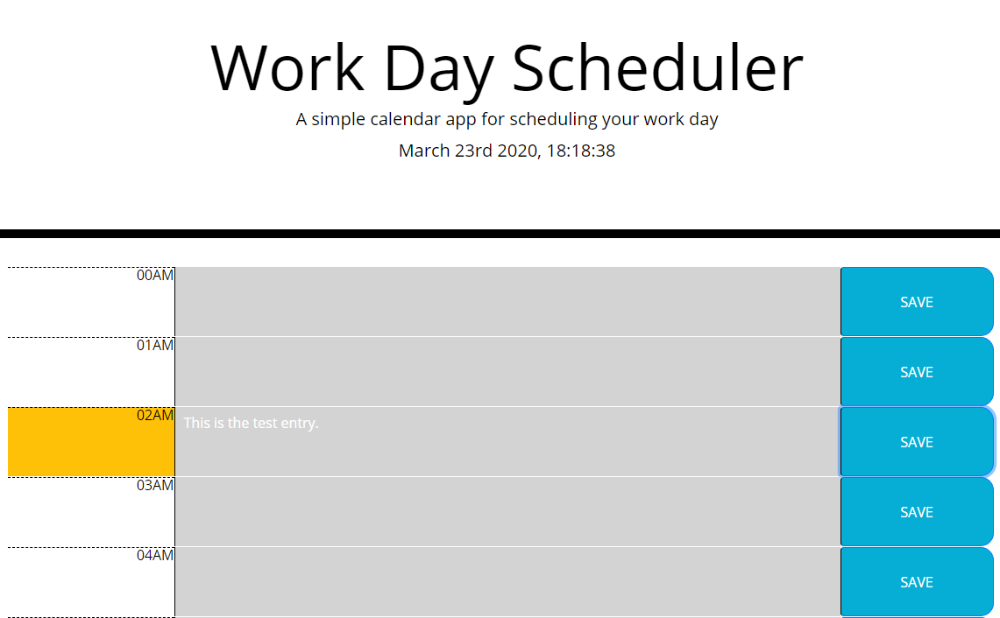

# Work Day Scheduler

Simple work day scheduler.  

## Getting Started

Open the web browser and the work day scheduler will generate entry for each hour of the day ... (and night). 
You can add your notes and click save button. Once saved, you can close the web page. When you open it again, you will get the previous data displayed.

Actual hour is highlighted in red. 

## Prerequisities

You just need a web browser. The project was tested on:
* desktop Chrome
* mobile Chrome

### Example

### Built with

To build this project I used:
* static html
* bootstrap
* custom css
* javascript (jQuery) managing DOM
* local storage